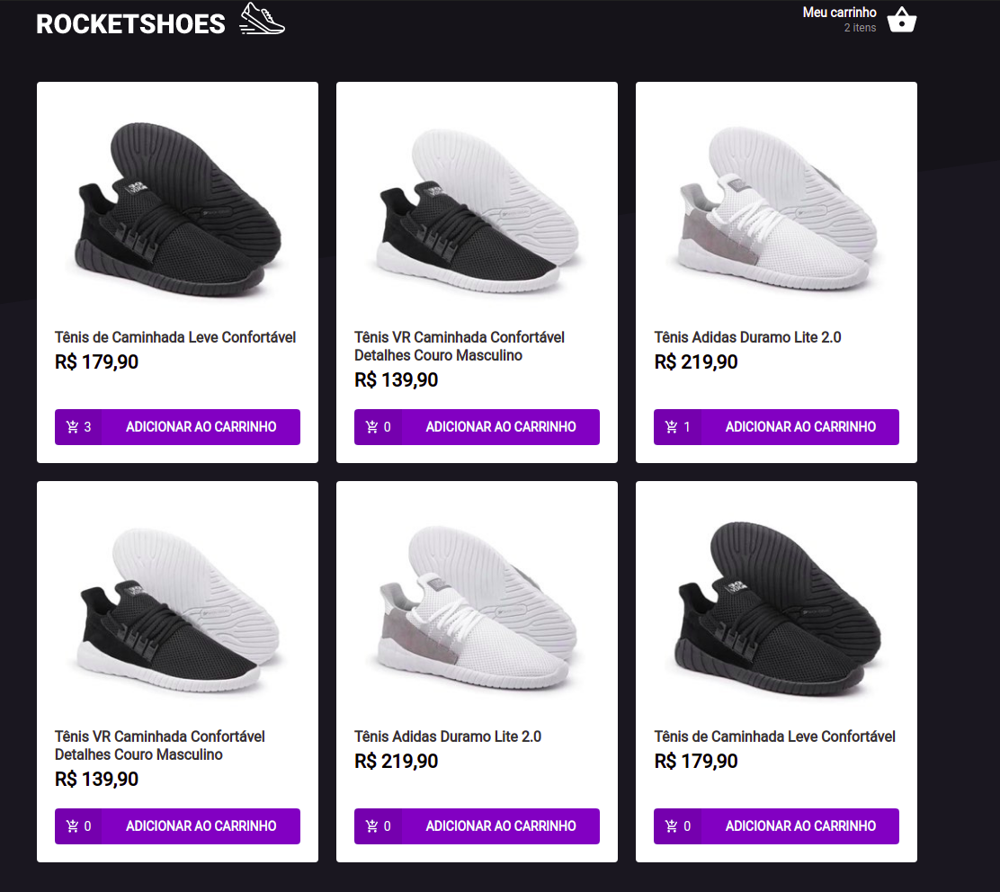
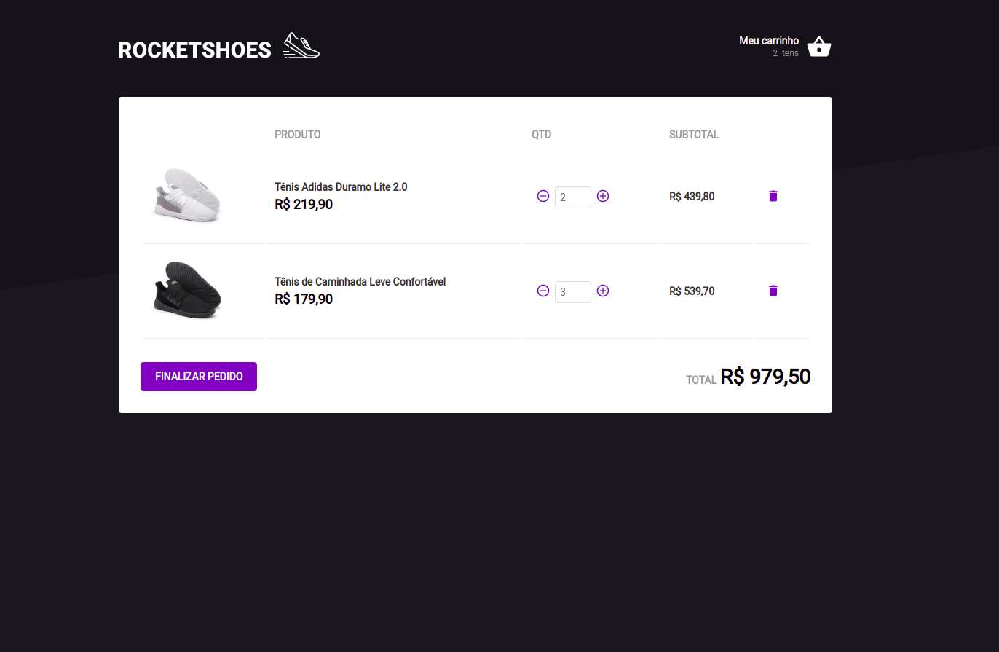

## Projeto

Um desafio do **Ignite Trilha React** da [Rocketseat](https://www.rocketseat.com.br).


## Executar a aplicação

Em caso de download do projeto você precisará baixar as dependências:  

**Necessário:** Yarn , utileze Yarn install

<ul>
 <li>Para iniciar o projeto, execute o comando abaixo:</li>
</ul>

```
yarn dev 
yarn serve para rodar o json server
Abrar o projeto em http://localhost:8080/
```

## Tecnologias utilizadas 🚀

<ul>
    <li><a href="https://reactjs.org/" target="_blank">React.js</a></li>
    <li><a href="https://www.typescriptlang.org/" target="_blank">TypeScript</a></li>  
</ul>


